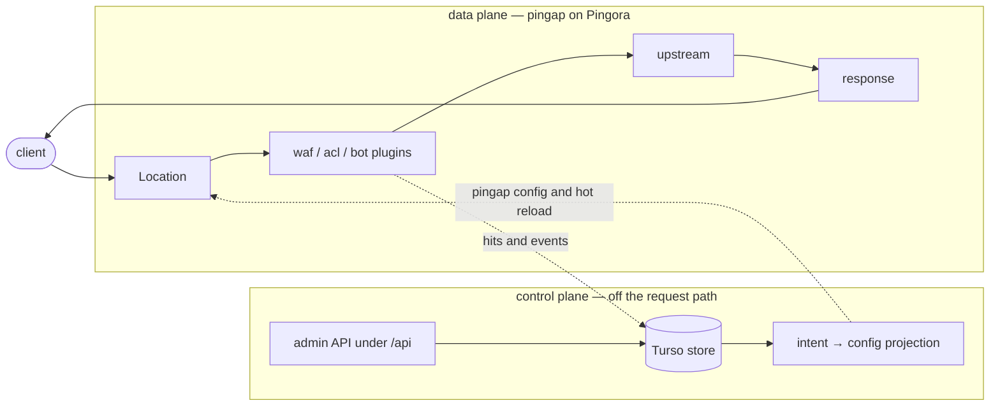

# pingap-waf

A fork of [pingap](https://github.com/vicanso/pingap) that adds a native WAF, a
domain-oriented ACL, JA4H bot management, and a control plane with per-user admin
auth — on top of the vendored pingap reverse proxy, which is kept at upstream paths
so `git merge upstream/main` stays readable.

> **This fork publishes no binaries, container images, or releases.** Build it from
> source. The `install.sh` and `docker-compose.yml` in this repository are upstream's
> and still resolve to `vicanso/pingap`, so both install **upstream pingap** — which
> contains none of the code described below, and whose binary is called `pingap`
> rather than this fork's `pingap-waf`. Likewise <https://pingap.io/> documents
> upstream; this fork's own features are documented under [`docs/`](./docs/README.md).

Vendored base: pingap **0.13.10**, commit `51025efca56f342a9a1e5e40559637f32b9140bf`
(tag `v0.13.10`, 2026-08-29), Apache-2.0. Provenance for every import is recorded in
[`NOTICE`](./NOTICE).

## What this fork adds

Five crates under `crates/`. The path prefix is the ownership marker: an unprefixed
`pingap-*` directory is vendored and carries merge debt, a `crates/`-prefixed one is
this fork's and carries none.

| Crate | Owns |
| --- | --- |
| [`pingap-waf`](./crates/pingap-waf) | Rule engine and detectors. Native Rust, CRS-category parity — no libmodsecurity, no SecLang, no C++ in the request path, which is what keeps the musl static build working |
| [`pingap-acl`](./crates/pingap-acl) | One rule table per domain plus an optional access list, evaluated top to bottom |
| [`pingap-bot`](./crates/pingap-bot) | JA4H client fingerprinting and the shipped bot library |
| [`pingap-controlplane`](./crates/pingap-controlplane) | Users, second factors, sessions and audit trail in a local Turso store; intent → config projection and versioning |
| [`pingap-admin-api`](./crates/pingap-admin-api) | REST surface over the control plane, served under `/api` on the admin listener |

Three new plugin categories register alongside upstream's: **`waf`**, **`acl`**,
**`bot`**. Each is attached per Location, so policy is scoped by which Locations name
it. A plugin name maps to one process-global instance — divergent policy means two
named entries (`waf:strict`, `waf:relaxed`), not one name listed twice.



The seam is one-directional and deliberate: **the gateway starts and serves with the
store absent, deleted, or unwritable**, because nothing in the store is on the request
path. See [control-plane store](./docs/control-plane-store.md).

## Boundaries worth knowing before you deploy

These are design decisions, not gaps to be filled quietly.

- **The WAF defaults to `detect`, and should stay there** until you know a category's
  false-positive rate on *your* traffic. The ported detectors measure 0 false positives
  over a frozen 560-case benign corpus — but that corpus is a regression fence, not a
  sample of production.
- **Enforcement is asymmetric, in the types.** Request-side can deny. Response-side can
  only log or rewrite bytes: `block` on a response category is rejected at config load
  rather than silently downgraded, because by the time a body hook runs the status and
  headers are already downstream, and a `block` that behaved as `redact` would report a
  leak as prevented when it was only rewritten on the way past.
- **JA4H is not JA4 and must not be presented as it.** It fingerprints how an HTTP
  client is written — method, version, which headers in what order — all of which an
  attacker imitates far more easily than a TLS stack. It is a client-behaviour signal,
  not an identity. TLS-level JA4/JA4S are deferred; JA4T/JA4TCP are a permanent non-goal
  because Pingora does not surface raw TCP SYN options. See [JA4 support](./docs/ja4-support.md).
- **The admin UI is unchanged upstream.** The React app in `web/` has no domain, WAF,
  ACL or bot pages. The control plane is reachable through the admin API, not through
  the UI.
- **Inspection cost lands on the allow path.** Blocking is cheaper, because evaluation
  stops at the threshold crossing. Numbers below.

## Latency

Measured on `x86_64-unknown-linux-gnu`, release profile, with 153 native request rules
and 40 response rules compiled from the ported detector set. p99 added latency, 2000
timed calls after a 200-call warmup:

| Shape | p50 | p99 |
| --- | --- | --- |
| request: headers + URI + query | 769 µs | **815 µs** |
| request: same, plus a 1 KB body | 2.80 ms | **2.87 ms** |
| response: 1 KB body, one hook | 1.34 ms | **1.39 ms** |
| response: 1 KB body, both hooks (cache miss) | 2.69 ms | **2.74 ms** |

Worst realistic request — a `POST` with a 1 KB body to a cacheable Location, on a cache
miss, paying both the request-body scan and both response scans: **≈ 5.6 ms p99**.

The distributions are tight: p99 sits within 6% of p50 on every shape and the maximum
within 20%. Cost is proportional to rules × fields × bytes, not driven by a backtracking
tail. Zero budget cuts at the shipped 10 ms budget, so these are the rules' real cost
rather than the budget's ceiling.

**Whether the defaults should ship as-is or behind a prefilter is an open decision, not
a settled one.** Reproduce both tables and read the structural cause in
[WAF latency](./docs/waf-benchmark.md):

```bash
cargo bench -p pingap-waf --bench latency   # per-call p50/p99
cargo bench -p pingap-waf --bench bench     # criterion A/B against the pre-detector floor
```

For base proxy throughput (147k req/s `wrk` on an M4 Pro, upstream's measurement), see
[upstream pingap](https://github.com/vicanso/pingap).

## Building

Prerequisites:

- **Rust** — [`rust-toolchain.toml`](./rust-toolchain.toml) pins 1.98.0; the workspace
  MSRV is 1.88. The pin is deliberate: this is a deployed security product, so the
  compiler is part of the reproducible build surface.
- **`protoc`** — `etcd-client` compiles etcd's `.proto` files through prost-build from
  its build script, and `pingap-config` depends on it unconditionally for the `etcd://`
  backend. `apt-get install protobuf-compiler`, or set `PROTOC`. CI and the
  [`Dockerfile`](./Dockerfile) both install it.
- **Node.js** — only for the admin UI assets. `dist/README.md` is tracked so a fresh
  clone compiles without them; the binary just embeds an empty admin UI.

```bash
# admin UI assets, embedded into the binary at compile time by rust-embed
make build-web

# debug build with hot reload and the admin UI on 127.0.0.1:3018
make dev

# release builds — see the Makefile for the full matrix
make release          # default features
make release-full     # tracing + imageoptim
make release-perf     # release-perf profile, includes the pyroscope agent

# validate a config and exit
./target/release/pingap-waf --conf ./examples/grpc-web/grpc-web.toml -t
```

The **binary** is `pingap-waf`; the Cargo **package** is still `pingap`. The fork's
own WAF crate at `crates/pingap-waf` already owns the other name and cargo refuses
two packages with one name in a workspace, so an explicit `[[bin]]` renames the
target instead. `--help`, `--version`, the Docker `CMD` and the systemd unit
(`pingap-waf.service`) all say `pingap-waf`. Runtime contracts keep upstream's
names — `PINGAP_*`, `/etc/pingap`, `/run/pingap.pid`, `/tmp/pingap_upgrade.sock` —
because those are not build artifacts, and `pingap-controlplane` uses `pingap` as
its token issuer while `pingap-cache` uses it as its on-disk namespace. See
[`NOTICE`](./NOTICE) divergence 6.

### Features

| Feature | Enables |
| --- | --- |
| `geo` | `pingap-plugin/geo` **and** `pingap-acl/geo` together — enabling only one would give an operator `geo_restriction` while silently refusing every ACL `geo_country` rule, or the reverse |
| `tracing` | OpenTelemetry, Sentry, Prometheus cache metrics |
| `imageoptim` | PNG/JPEG → WebP/AVIF |
| `full` | `tracing` + `imageoptim`; required by `make test` and `make lint` |
| `pyro`, `perf` | pyroscope agent; `perf` pairs with the `release-perf` profile |

## Configuration

The three fork plugins attach like any other pingap plugin:

```toml
[basic]
# Required the moment any waf plugin sets `ip_list`: without a trusted-proxy list
# pingap honours X-Forwarded-For unconditionally, which is fine for logging and not
# a basis for an access decision, because the address is then one the client chose.
trusted_proxies = ["10.0.0.0/8"]

[plugins."waf:strict"]
category            = "waf"
categories          = { sql_injection = "block", xss = "detect", local_file_inclusion = "block" }
paranoia            = 2          # 1–4; rules above the level do not participate
anomaly_threshold   = 5          # accumulated score at which `block` refuses
budget_ms           = 10         # per-request evaluation budget
body_inspect_limit  = 131072     # 0 is refused — there is no "inspect nothing" setting

[plugins."acl:public"]
category       = "acl"
default_action = "allow"
rules = [
  { field = "user_agent", operator = "regex",   values = ["(?i)(nikto|sqlmap)"], action = "deny" },
  { field = "method",     operator = "in_list", values = ["TRACE", "TRACK"],     action = "deny" },
  { field = "ip",         operator = "in_cidr", values = ["10.0.0.0/8"],         action = "log" },
]

[plugins."bot:default"]
category = "bot"

[locations.app]
upstream = "app"
plugins  = ["waf:strict", "acl:public", "bot:default"]
```

A **domain** is the object operators think in — a hostname, where its traffic goes, and
what policy applies. Pingap has no such object and this fork does not add one to the
data plane: a domain is a *projection* that resolves entirely onto config pingap already
has. Every domain field names the config key it maps to, and a field with no mapping is
rejected at design time, because the alternative is silently dropping what an operator
set. See [the domain model](./docs/domain-model.md) and
[config projection](./docs/config-projection.md).

Upstream config formats (TOML, HCL, KDL), hot reload, ACME, upstreams, caching and the
plugin set are unchanged — see [`conf/`](./conf), [`examples/`](./examples/README.md)
and <https://pingap.io/> for that surface.

## Development

```bash
make lint     # typos + clippy under `full` and under `geo`, -D warnings
make fmt
make test     # cargo test --workspace --features=full — needs etcd on :2379
make bench
make cov
```

`make test` needs a real etcd for `pingap-config`'s etcd manager test:

```bash
docker run -d --rm -p 2379:2379 \
  -e ETCD_ADVERTISE_CLIENT_URLS=http://0.0.0.0:2379 \
  -e ETCD_LISTEN_CLIENT_URLS=http://0.0.0.0:2379 \
  quay.io/coreos/etcd:v3.5.5
```

CI ([`.github/workflows/ci.yml`](./.github/workflows/ci.yml)) runs `cargo fmt --check`,
clippy under `full` and under `geo`, the test suite against an etcd service container, a
release link, and two invariants asserted against the tree: exactly one pingora version
(`0.8.1`) and exactly one `impl ProxyHttp`. A separate
[Security Audit](./.github/workflows/audit.yml) runs `cargo-audit` on push and nightly;
every advisory it ignores is listed in [`.cargo/audit.toml`](./.cargo/audit.toml) with
the reason and what unblocks removing it.

Pingora is pinned to `0.8.1` with only `lb`, `openssl` and `cache` enabled. Build the
pingora `Server` with `Server::new_with_opt_and_conf` — since 0.8.1 the constructor
snapshots the configuration into a private `Bootstrap`, and that snapshot, not
`Server::configuration`, is what the receiving half of a hot upgrade reads `upgrade_sock`
from.

## Documentation

| Topic | |
| --- | --- |
| WAF | [plugin reference](./docs/waf-plugin.md) · [category → CRS lineage](./docs/waf-category-mapping.md) · [latency](./docs/waf-benchmark.md) |
| ACL and domains | [plugin reference](./docs/acl-plugin.md) · [domain model](./docs/domain-model.md) |
| Bot management | [JA4 support and the `bot` plugin](./docs/ja4-support.md) |
| Control plane | [store, per-user admin auth, driver constraints](./docs/control-plane-store.md) · [config projection and versioning](./docs/config-projection.md) |
| Upstream surface | [crate index](./docs/README.md) · [modules](./docs/modules.md) · [plugins](./pingap-plugin/README.md) · [examples](./examples/README.md) |

This fork's documentation is English-only.

## Licence

Apache-2.0 — see [`LICENSE`](./LICENSE). This fork is a derivative of pingap by
Tree Xie, vendored and attributed in [`NOTICE`](./NOTICE) together with the exact
upstream commit each import came from.
