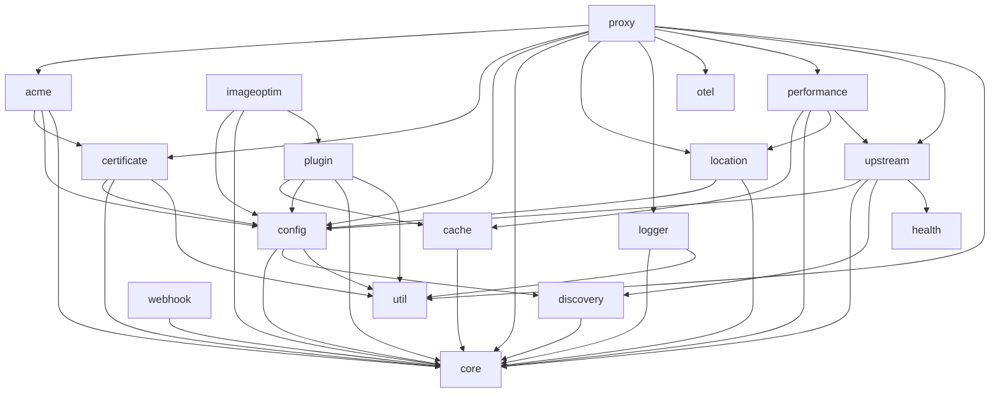
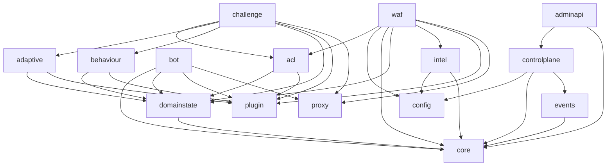

# Pingap Modules 

- `acme`: Handles Automated Certificate Management Environment (ACME) protocol for automated SSL/TLS certificate issuance and renewal
- `cache`: Manages caching mechanisms for improved performance and reduced backend load
- `certificate`: Handles SSL/TLS certificate management, storage, and validation
- `config`: Provides configuration management and parsing functionality
- `core`: Contains essential functionality and shared components used across other modules
- `discovery`: Implements service discovery mechanisms for dynamic backend detection
- `health`: Manages health checks and monitoring of backend services
- `location`: Handles URL routing and location-based request processing
- `logger`: Provides logging functionality and log management
- `otel`: Implements OpenTelemetry integration for distributed tracing and metrics
- `performance`: Provides performance metrics 
- `proxy`: Proxy server for pingap
- `plugin`: Manages plugin system for extending functionality
- `pyroscope`: Integrates with Pyroscope for continuous profiling
- `sentry`: Provides error tracking and monitoring via Sentry integration
- `upstream`: Manages backend server connections and load balancing
- `util`: Contains shared utility functions and helper methods
- `webhook`: Supports several webhook protocols for sending notifications to external services
- `imageoptim`: Image optimize, which supports png, jpeg, webp and avif

## Fork crates (`crates/`)

The fork adds its own crates under `crates/`, layered the same way as the vendored ones.
`pingap-core` and `pingap-config` are the shared spine every one of them reads; `proxy`
is the only caller of the data-plane plugins. The graph below shows the fork edges that
matter — the security-enforcing plugins, the state they share, and the control plane.

| Crate | Role in the request path |
| --- | --- |
| `pingap-domainstate` | Bounded `(domain, client-ip)`-keyed expiring state; the three-way client-identity contract every stateful control resolves |
| `pingap-events` | The shared event queue every WAF verdict offers to |
| `pingap-acl` | Per-domain ACL rules, access lists, the `challenge` marker |
| `pingap-waf` | The native rule engine and its plugin; consults `intel` feeds and the `acl` marker |
| `pingap-intel` | Threat-feed fetch, the Tier-1 egress guard, the threat set |
| `pingap-bot` | JA4H fingerprinting and the `bot` plugin |
| `pingap-behaviour` | Per-client behavioural signals feeding the challenge tier |
| `pingap-adaptive` | Hourly baselines and the limit multiplier that modulates policy |
| `pingap-challenge` | PoW/silent-JS challenge tier reading `acl`/`waf` markers plus behaviour/adaptive signals |
| `pingap-controlplane` | Users, sessions, RBAC, audit log, config projection, the Turso store |
| `pingap-admin-api` | The admin-API route table over the control plane |
